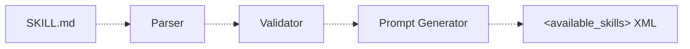

# skills-rs

Reference implementations for the Agent Skills specification.

> [!IMPORTANT]
> These libraries are intended for demonstration purposes only. They are not meant to be used in production.

This repository contains two independent implementations of the same pipeline — **parse, validate, and generate prompts** from `SKILL.md` files:

| Directory | Language | Tests |
|-----------|----------|-------|
| `py/`     | Python   | 40    |
| `rs/`     | Rust     | 47    |

Both implementations expose the same CLI subcommands and produce identical output.

## CLI Usage

```bash
# Validate a skill directory
skills-ref validate path/to/skill

# Read skill properties (outputs JSON)
skills-ref read-properties path/to/skill

# Generate <available_skills> XML for agent prompts
skills-ref to-prompt path/to/skill-a path/to/skill-b
```

## Python

Requires Python >= 3.11.

```bash
cd py/
uv sync
uv run skills-ref validate path/to/skill
```

See [`py/README.md`](py/README.md) for full details including the Python API.

## Rust

Requires a stable Rust toolchain.

```bash
cd rs/
cargo build --release
./target/release/skills-ref validate path/to/skill
```

### Running tests

```bash
cargo test
```

## Architecture

Both implementations follow the same pipeline:



- **Parser** — Finds and parses `SKILL.md` files (YAML frontmatter + markdown body)
- **Validator** — Validates skill properties (name constraints, field limits, directory name match, i18n with NFKC normalization)
- **Prompt Generator** — Generates `<available_skills>` XML blocks for agent system prompts

## License

Apache 2.0
